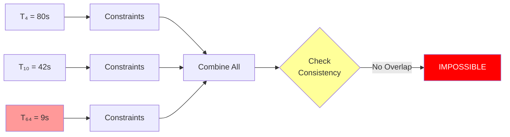
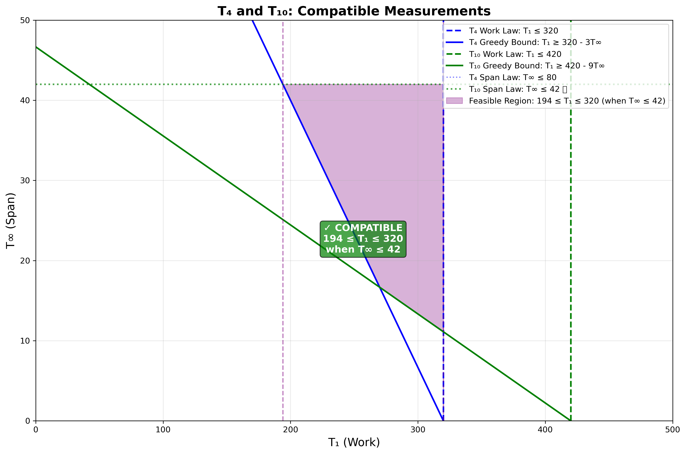
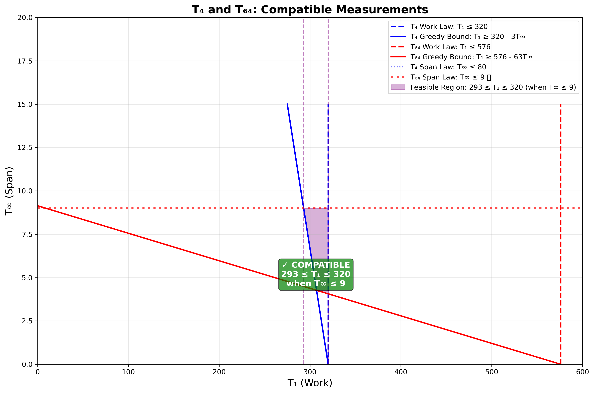
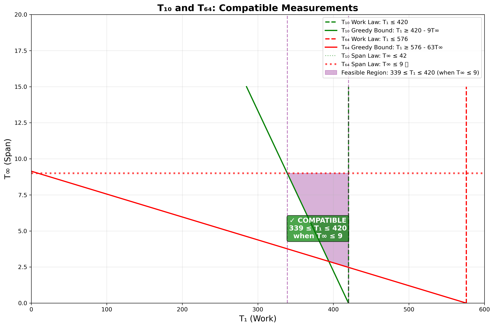
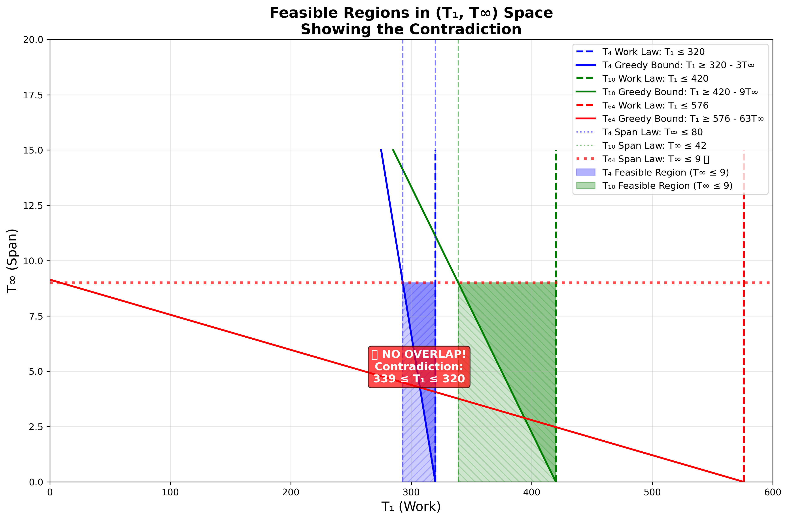

# Inconsistent Parallel Execution Time Measurements

> "The work-span model provides fundamental limits on parallel
> performance, independent of the scheduling algorithm." - CLRS Chapter 27

---

## Table of Contents

- [Problem Statement](#problem-statement)
- [Constraints from Each Measurement](#constraints-from-each-measurement)
  - [Constraints from $T_4 = 80$](#constraints-from-t_4--80)
  - [Constraints from $T_{10} = 42$](#constraints-from-t_10--42)
  - [Constraints from $T_{64} = 9$](#constraints-from-t_64--9)
- [Finding a Contradiction](#finding-a-contradiction)
  - [Step 1: Combine Span Law Constraints](#step-1-combine-span-law-constraints)
  - [Step 2: Check Consistency of $T_4$ and $T_{10}$](#step-2-check-consistency-of-t_4-and-t_10)
- [Visual Summary of Constraints](#visual-summary-of-constraints)
  - [Constraint Relationships](#constraint-relationships)
  - [Constraint Values Summary](#constraint-values-summary)
- [Intuitive Understanding of the Contradiction](#intuitive-understanding-of-the-contradiction)
  - [Why the Measurements Cannot All Be Correct](#why-the-measurements-cannot-all-be-correct)
  - [The Greedy Scheduler Bound in Action](#the-greedy-scheduler-bound-in-action)
  - [Pairwise Compatibility Analysis](#pairwise-compatibility-analysis)
  - [Visual Plot of the Contradiction](#visual-plot-of-the-contradiction)
  - [Plot Generation Code](#plot-generation-code)
- [What Could Have Gone Wrong?](#what-could-have-gone-wrong)
- [Conclusion](#conclusion)

---

## Problem Statement

Ben Bitdiddle measures the running time of his deterministic parallel
program scheduled using a greedy scheduler on an ideal parallel
computer with 4, 10, and 64 processors. Ben obtains the following
running times:
- $T_4 = 80$ seconds
- $T_{10} = 42$ seconds
- $T_{64} = 9$ seconds

Argue that Ben messed up at least one of his measurements.

---

## Constraints from Each Measurement

For any valid set of measurements, the following laws must be satisfied:
- **Work Law**: $T_P \geq T_1/P$
- **Span Law**: $T_P \geq T_{\infty}$
- **Greedy Scheduler Bound**: $T_P \leq (T_1 - T_{\infty})/P + T_{\infty}$

Let us derive constraints from each measurement.

### Constraints from $T_4 = 80$

**Work Law**:
$$
T_1 \leq 320
$$

**Span Law**:
$$
T_{\infty} \leq 80
$$

**Greedy Scheduler Bound**:
$$
T_1 \geq 320 - 3T_{\infty}
$$

### Constraints from $T_{10} = 42$

**Work Law**:
$$
T_1 \leq 420
$$

**Span Law**:
$$
T_{\infty} \leq 42
$$

**Greedy Scheduler Bound**:
$$
T_1 \geq 420 - 9T_{\infty}
$$

### Constraints from $T_{64} = 9$

**Work Law**:
$$
T_1 \leq 576
$$

**Span Law**:
$$
T_{\infty} \leq 9
$$

**Greedy Scheduler Bound**:
$$
T_1 \geq 576 - 63T_{\infty}
$$

---

## Finding a Contradiction

### Step 1: Combine Span Law Constraints

From the Span Law:
- $T_{\infty} \leq 80$ (from $T_4$)
- $T_{\infty} \leq 42$ (from $T_{10}$)
- $T_{\infty} \leq 9$ (from $T_{64}$)

The tightest constraint is:

$$
T_{\infty} \leq 9
$$

### Step 2: Check Consistency of $T_4$ and $T_{10}$

If $T_{\infty} \leq 9$, then from the greedy scheduler bounds:
- From $T_4$: $T_1 \geq 320 - 3T_{\infty} \geq 320 - 3(9) = 293$
- From $T_{10}$: $T_1 \geq 420 - 9T_{\infty} \geq 420 - 9(9) = 339$

Also from Work Law:
- From $T_4$: $T_1 \leq 320$
- From $T_{10}$: $T_1 \leq 420$

So we need:

$$
339 \leq T_1 \leq 320
$$

This is **impossible**! There is no value of $T_1$ that satisfies both
$339 \leq T_1$ and $T_1 \leq 320$.

This contradiction proves that **at least one measurement is
incorrect**.

---

## Visual Summary of Constraints

Now that we've derived the contradiction step-by-step, here's a summary of how
the constraints from each measurement relate to each other:

### Constraint Relationships

The three measurements create constraints that must be satisfied simultaneously:



**Key insight**: When we apply the tightest span constraint ($T_{\infty} \leq 9$ from $T_{64}$)
and combine it with the greedy scheduler bounds from $T_4$ and $T_{10}$, we get
incompatible requirements on $T_1$, leading to the contradiction $339 \leq T_1 \leq 320$
(see [Step 2](#step-2-check-consistency-of-t_4-and-t_10) above for the detailed derivation).

### Constraint Values Summary

| Measurement   | Work Law       | Span Law               | Greedy Bound (when $T_{\infty} = 9$) |
|---------------|----------------|------------------------|--------------------------------------|
| $T_4 = 80$    | $T_1 \leq 320$ | $T_{\infty} \leq 80$   | $T_1 \geq 293$                       |
| $T_{10} = 42$ | $T_1 \leq 420$ | $T_{\infty} \leq 42$   | $T_1 \geq 339$                       |
| $T_{64} = 9$  | $T_1 \leq 576$ | $T_{\infty} \leq 9$ ⭐ | $T_1 \geq 10$                        |

**Note**: For generating actual 2D plots of the feasible regions, see the
[Plot Generation Code](#plot-generation-code) section below.

---

## Intuitive Understanding of the Contradiction

### Why the Measurements Cannot All Be Correct

The contradiction $339 \leq T_1 \leq 320$ is **mathematically impossible**—no
number can be both at least 339 and at most 320. This impossibility arises
from the fundamental laws of parallel computation, which must hold for any
valid parallel algorithm.

**The core issue**: The three measurements tell conflicting stories about
the algorithm's work and span:

1. **$T_{64} = 9$ says**: "The critical path is very short ($T_{\infty} \leq
   9$), so the algorithm has high parallelism potential."

2. **$T_{10} = 42$ says**: "With 10 processors, it takes 42 seconds. Given
   the short span, this implies significant work ($T_1 \geq 339$)."

3. **$T_4 = 80$ says**: "With 4 processors, it takes 80 seconds. This
   implies limited work ($T_1 \leq 320$)."

These cannot all be true simultaneously. If the span is short (from $T_{64}$)
and the work is large (from $T_{10}$), then with 4 processors we should see
better performance than 80 seconds. Conversely, if the work is limited (from
$T_4$), then with 10 processors we shouldn't need 42 seconds.

**Geometric interpretation**: Think of the measurements as constraints in a 2D
space (work vs. span). When we combine the feasible regions from all three
measurements, **they don't overlap**—there's no point $(T_1, T_{\infty})$ that
satisfies all three constraints simultaneously. The actual 2D visualization of
this contradiction is shown in the [Visual Plot of the Contradiction](#visual-plot-of-the-contradiction)
section below.

### The Greedy Scheduler Bound in Action

The greedy scheduler bound $T_P \leq (T_1 - T_{\infty})/P + T_{\infty}$ is
the key to detecting the inconsistency. This bound says:

> "With $P$ processors, execution time is at most the average work per
> processor plus the span."

When we apply this bound to different processor counts, we get different
constraints on $T_1$ and $T_{\infty}$. The measurements violate these
constraints, revealing the inconsistency. The contradiction emerges from the
**interaction** between the Work Law and the greedy scheduler bound across
different processor counts, as shown in [Step 2](#step-2-check-consistency-of-t_4-and-t_10).

### Pairwise Compatibility Analysis

To understand which measurement is incompatible, let's examine each pair of
measurements:

#### T₄ and T₁₀: Compatible



When considering only $T_4 = 80$ and $T_{10} = 42$:
- **Tightest span constraint**: $T_{\infty} \leq 42$ (from $T_{10}$)
- **When $T_{\infty} \leq 42$**:
  - From $T_4$ greedy bound: $T_1 \geq 320 - 3(42) = 194$
  - From $T_{10}$ greedy bound: $T_1 \geq 420 - 9(42) = 42$
  - From $T_4$ work law: $T_1 \leq 320$
  - From $T_{10}$ work law: $T_1 \leq 420$

**Result**: $194 \leq T_1 \leq 320$ is **feasible** ✓

The purple shaded region shows the feasible region where both measurements can
be satisfied simultaneously. **$T_4$ and $T_{10}$ are compatible.**

#### T₄ and T₆₄: Compatible



When considering only $T_4 = 80$ and $T_{64} = 9$:
- **Tightest span constraint**: $T_{\infty} \leq 9$ (from $T_{64}$)
- **When $T_{\infty} \leq 9$**:
  - From $T_4$ greedy bound: $T_1 \geq 320 - 3(9) = 293$
  - From $T_{64}$ greedy bound: $T_1 \geq 576 - 63(9) = -9$ (not restrictive)
  - From $T_4$ work law: $T_1 \leq 320$
  - From $T_{64}$ work law: $T_1 \leq 576$

**Result**: $293 \leq T_1 \leq 320$ is **feasible** ✓

The purple shaded region shows the feasible region. **$T_4$ and $T_{64}$ are
compatible.**

#### T₁₀ and T₆₄: Compatible



When considering only $T_{10} = 42$ and $T_{64} = 9$:
- **Tightest span constraint**: $T_{\infty} \leq 9$ (from $T_{64}$)
- **When $T_{\infty} \leq 9$**:
  - From $T_{10}$ greedy bound: $T_1 \geq 420 - 9(9) = 339$
  - From $T_{64}$ greedy bound: $T_1 \geq 576 - 63(9) = -9$ (not restrictive)
  - From $T_{10}$ work law: $T_1 \leq 420$
  - From $T_{64}$ work law: $T_1 \leq 576$

**Result**: $339 \leq T_1 \leq 420$ is **feasible** ✓

The purple shaded region shows the feasible region. **$T_{10}$ and $T_{64}$ are
compatible.**

#### Summary: All Pairs Are Compatible!

**Key insight**: Each pair of measurements is compatible when considered in
isolation:
- ✓ $T_4$ and $T_{10}$: $194 \leq T_1 \leq 320$ (when $T_{\infty} \leq 42$)
- ✓ $T_4$ and $T_{64}$: $293 \leq T_1 \leq 320$ (when $T_{\infty} \leq 9$)
- ✓ $T_{10}$ and $T_{64}$: $339 \leq T_1 \leq 420$ (when $T_{\infty} \leq 9$)

**The contradiction only arises when all three measurements are considered
together**:
- From $T_4$ and $T_{64}$: $293 \leq T_1 \leq 320$
- From $T_{10}$ and $T_{64}$: $339 \leq T_1 \leq 420$
- **No overlap**: $339 \leq T_1 \leq 320$ is impossible!

This demonstrates that **$T_{64}$ is incompatible with the combination of $T_4$
and $T_{10}$**, even though it's compatible with each individually.

### Visual Plot of the Contradiction

The following plot visualizes all constraints and clearly demonstrates the
contradiction:



**What the plot shows**:

1. **Constraint Lines**:
   - **Blue lines**: Constraints from $T_4 = 80$
     - Dashed vertical line: Work Law ($T_1 \leq 320$)
     - Solid diagonal line: Greedy Scheduler Bound ($T_1 \geq 320 - 3T_{\infty}$)
     - Dotted horizontal line: Span Law ($T_{\infty} \leq 80$)
   
   - **Green lines**: Constraints from $T_{10} = 42$
     - Dashed vertical line: Work Law ($T_1 \leq 420$)
     - Solid diagonal line: Greedy Scheduler Bound ($T_1 \geq 420 - 9T_{\infty}$)
     - Dotted horizontal line: Span Law ($T_{\infty} \leq 42$)
   
   - **Red lines**: Constraints from $T_{64} = 9$
     - Dashed vertical line: Work Law ($T_1 \leq 576$)
     - Solid diagonal line: Greedy Scheduler Bound ($T_1 \geq 576 - 63T_{\infty}$)
     - Thick dotted horizontal line: Span Law ($T_{\infty} \leq 9$) ⭐ **tightest constraint**

2. **Feasible Regions** (when $T_{\infty} \leq 9$):
   - **Blue shaded region**: Feasible region from $T_4$ measurements
     - Bounded by: $T_1 \geq 293$ (from greedy bound) and $T_1 \leq 320$ (from work law)
     - Represents: $293 \leq T_1 \leq 320$ when $T_{\infty} \leq 9$
   
   - **Green shaded region**: Feasible region from $T_{10}$ measurements
     - Bounded by: $T_1 \geq 339$ (from greedy bound) and $T_1 \leq 420$ (from work law)
     - Represents: $339 \leq T_1 \leq 420$ when $T_{\infty} \leq 9$

3. **The Contradiction**:
   - The blue and green regions **do not overlap**
   - There is a **gap** between $T_1 = 320$ (end of blue region) and $T_1 = 339$ (start of green region)
   - The red annotation highlights: **339 ≤ T₁ ≤ 320 is IMPOSSIBLE**
   - This gap of 19 units (339 - 320) represents the contradiction

4. **Key Observations**:
   - The red horizontal line at $T_{\infty} = 9$ is the **tightest span constraint**
   - When we apply this constraint, the greedy scheduler bounds create incompatible requirements
   - The blue region requires $T_1 \leq 320$, while the green region requires $T_1 \geq 339$
   - **No point** $(T_1, T_{\infty})$ can satisfy both requirements simultaneously

**Why this visualization is powerful**:
- It makes the abstract mathematical contradiction **visually concrete**
- The gap between regions is immediately apparent
- All constraint types (Work Law, Span Law, Greedy Scheduler Bound) are clearly distinguished
- The plot shows that the contradiction is not a subtle edge case, but a **fundamental incompatibility**

### Plot Generation Code

The plots in this write-up are generated using Python scripts located in the
`scripts/` directory. The generated plots are saved in the `plots/` directory.

**Available scripts**:
- `scripts/generate_contradiction_plot.py`: Generates the main contradiction plot
- `scripts/generate_pairwise_plots.py`: Generates all pairwise compatibility plots

**To regenerate plots**, run from the `hw5/` directory:
```bash
cd hw5
python3 scripts/generate_contradiction_plot.py
python3 scripts/generate_pairwise_plots.py
```

For generating high-quality 2D plots of the feasible regions, use the following
Python code with matplotlib:

```python
import matplotlib.pyplot as plt
import numpy as np

# Create figure
fig, ax = plt.subplots(figsize=(12, 8))

# Define T_infinity range
T_inf = np.linspace(0, 15, 1000)

# Constraint lines from T_4 = 80
T1_T4_work = np.full_like(T_inf, 320)  # T_1 ≤ 320
T1_T4_greedy = 320 - 3 * T_inf  # T_1 ≥ 320 - 3T_∞

# Constraint lines from T_10 = 42
T1_T10_work = np.full_like(T_inf, 420)  # T_1 ≤ 420
T1_T10_greedy = 420 - 9 * T_inf  # T_1 ≥ 420 - 9T_∞

# Constraint lines from T_64 = 9
T1_T64_work = np.full_like(T_inf, 576)  # T_1 ≤ 576
T1_T64_greedy = 576 - 63 * T_inf  # T_1 ≥ 576 - 63T_∞

# Plot constraint lines
ax.plot(T1_T4_work, T_inf, 'b--', label='T₄ Work Law: T₁ ≤ 320', linewidth=2)
ax.plot(T1_T4_greedy, T_inf, 'b-', label='T₄ Greedy Bound: T₁ ≥ 320 - 3T∞', linewidth=2)
ax.plot(T1_T10_work, T_inf, 'g--', label='T₁₀ Work Law: T₁ ≤ 420', linewidth=2)
ax.plot(T1_T10_greedy, T_inf, 'g-', label='T₁₀ Greedy Bound: T₁ ≥ 420 - 9T∞', linewidth=2)
ax.plot(T1_T64_work, T_inf, 'r--', label='T₆₄ Work Law: T₁ ≤ 576', linewidth=2)
ax.plot(T1_T64_greedy, T_inf, 'r-', label='T₆₄ Greedy Bound: T₁ ≥ 576 - 63T∞', linewidth=2)

# Span Law horizontal lines
ax.axhline(y=80, color='b', linestyle=':', alpha=0.5, label='T₄ Span Law: T∞ ≤ 80')
ax.axhline(y=42, color='g', linestyle=':', alpha=0.5, label='T₁₀ Span Law: T∞ ≤ 42')
ax.axhline(y=9, color='r', linestyle=':', linewidth=3, label='T₆₄ Span Law: T∞ ≤ 9 ⭐', alpha=0.7)

# Highlight feasible regions when T∞ ≤ 9
T_inf_constrained = np.linspace(0, 9, 1000)
T1_T4_feasible_low = 320 - 3 * T_inf_constrained
T1_T4_feasible_high = np.full_like(T_inf_constrained, 320)
T1_T10_feasible_low = 420 - 9 * T_inf_constrained
T1_T10_feasible_high = np.full_like(T_inf_constrained, 420)

# Fill feasible regions
ax.fill_betweenx(T_inf_constrained, T1_T4_feasible_low, T1_T4_feasible_high, 
                 where=(T1_T4_feasible_low <= T1_T4_feasible_high),
                 alpha=0.3, color='blue', label='T₄ Feasible Region (T∞ ≤ 9)')
ax.fill_betweenx(T_inf_constrained, T1_T10_feasible_low, T1_T10_feasible_high,
                 where=(T1_T10_feasible_low <= T1_T10_feasible_high),
                 alpha=0.3, color='green', label='T₁₀ Feasible Region (T∞ ≤ 9)')

# Mark the contradiction
ax.axvline(x=293, color='blue', linestyle='--', alpha=0.5)
ax.axvline(x=320, color='blue', linestyle='--', alpha=0.5)
ax.axvline(x=339, color='green', linestyle='--', alpha=0.5)
ax.fill_between([293, 320], 0, 9, alpha=0.2, color='blue', hatch='///')
ax.fill_between([339, 420], 0, 9, alpha=0.2, color='green', hatch='\\\\\\')
ax.text(306.5, 4.5, '❌ NO OVERLAP!\nContradiction:\n339 ≤ T₁ ≤ 320', 
        bbox=dict(boxstyle='round', facecolor='red', alpha=0.7, edgecolor='black'),
        fontsize=12, ha='center', color='white', weight='bold')

# Labels and title
ax.set_xlabel('T₁ (Work)', fontsize=14)
ax.set_ylabel('T∞ (Span)', fontsize=14)
ax.set_title('Feasible Regions in (T₁, T∞) Space\nShowing the Contradiction', fontsize=16, weight='bold')
ax.legend(loc='upper right', fontsize=10)
ax.grid(True, alpha=0.3)
ax.set_xlim(0, 600)
ax.set_ylim(0, 20)

plt.tight_layout()
plt.savefig('plots/contradiction_plot.png', dpi=300, bbox_inches='tight')
plt.show()
```

This code generates a publication-quality plot showing:
- All constraint lines (Work Law, Span Law, Greedy Scheduler Bound)
- Feasible regions for each measurement when $T_{\infty} \leq 9$
- The gap between regions demonstrating the contradiction
- Clear annotations highlighting the impossible region

**Constraint line equations**:
- **From $T_4 = 80$:**
  - Work Law: $T_1 = 320$ (vertical line)
  - Span Law: $T_{\infty} = 80$ (horizontal line)
  - Greedy Bound: $T_1 = 320 - 3T_{\infty}$ (diagonal, slope = -3)

- **From $T_{10} = 42$:**
  - Work Law: $T_1 = 420$ (vertical line)
  - Span Law: $T_{\infty} = 42$ (horizontal line)
  - Greedy Bound: $T_1 = 420 - 9T_{\infty}$ (diagonal, slope = -9)

- **From $T_{64} = 9$:**
  - Work Law: $T_1 = 576$ (vertical line)
  - Span Law: $T_{\infty} = 9$ (horizontal line) ⭐ tightest
  - Greedy Bound: $T_1 = 576 - 63T_{\infty}$ (diagonal, slope = -63)

---

## What Could Have Gone Wrong?

### Possible Sources of Measurement Error

1. **Timing errors**:
   - Clock synchronization issues
   - Measurement overhead not accounted for
   - System load affecting measurements
   - Incorrect time units (seconds vs. milliseconds)

2. **Algorithm inconsistency**:
   - Non-deterministic behavior (race conditions, random number generation)
   - Different inputs used for different measurements
   - Algorithm modifications between measurements
   - Compiler optimizations applied inconsistently

3. **Hardware/environment issues**:
   - Processor frequency scaling (turbo boost, power management)
   - Cache warm-up effects (first run vs. subsequent runs)
   - Memory bandwidth contention
   - Different processor architectures or configurations

4. **Scheduler behavior**:
   - Non-greedy scheduling (if the scheduler isn't truly greedy)
   - Load balancing issues
   - Overhead from work-stealing not accounted for

5. **Measurement methodology**:
   - Averaging inconsistent runs
   - Not accounting for initialization/cleanup time
   - Measuring wall-clock time instead of CPU time
   - Including I/O or other non-computation time

### Most Likely Scenarios

Given the pairwise compatibility analysis showing that:
- ✓ $T_4$ and $T_{10}$ are compatible
- ✓ $T_4$ and $T_{64}$ are compatible
- ✓ $T_{10}$ and $T_{64}$ are compatible
- ❌ All three together are incompatible

The most likely scenarios are:

1. **$T_{64}$ is wrong** (most likely): Since $T_4$ and $T_{10}$ are compatible
   with each other, and each is compatible with $T_{64}$ individually, but all
   three together create a contradiction, **$T_{64}$ is the problematic
   measurement**. The contradiction arises because $T_{64} = 9$ forces
   $T_{\infty} \leq 9$, which creates incompatible requirements when combined
   with $T_4$ and $T_{10}$.

   **Possible reasons**:
   - $T_{64}$ might actually be slower than 9 seconds (measurement error)
   - The span might be longer than 9 seconds, making $T_{64}$ inconsistent
   - System conditions during the $T_{64}$ measurement were different

2. **$T_4$ or $T_{10}$ is wrong** (less likely): While these two are compatible
   with each other, one could still be incorrect. However, since they work
   together and each works with $T_{64}$, this scenario is less likely.

3. **Non-deterministic algorithm**: If the algorithm has non-deterministic
   behavior, different runs might produce different execution times,
   invalidating the assumption of a deterministic program. This could explain
   why measurements are inconsistent.

### Practical Investigation Steps

To identify which measurement is wrong, Ben should:

1. **Re-measure all three values** under controlled conditions:
   - Same input, same hardware configuration
   - Multiple runs to check for consistency
   - Account for measurement overhead

2. **Check for non-determinism**:
   - Run the algorithm multiple times with the same input
   - Verify that execution times are consistent
   - Check for race conditions or random behavior

3. **Verify the scheduler**:
   - Confirm that a greedy scheduler is actually being used
   - Check for any scheduler overhead or non-ideal behavior

4. **Analyze the algorithm**:
   - Verify the algorithm is truly deterministic
   - Check that the same computation is performed in all cases
   - Ensure no external factors (I/O, network, etc.) affect timing

---

## Conclusion

The measurements are **inconsistent**. As shown in [Finding a Contradiction](#finding-a-contradiction),
the three measurements lead to the impossible requirement $339 \leq T_1 \leq 320$.

**Therefore, at least one of the measurements ($T_4$, $T_{10}$, or $T_{64}$) must be incorrect.**

The contradiction shows that it is impossible for all three
measurements to be correct simultaneously, given the fundamental laws
of parallel computation (Work Law, Span Law, and Greedy Scheduler
Bound).

### Key Takeaways

1. **Fundamental laws are inviolable**: The Work Law, Span Law, and Greedy
   Scheduler Bound are mathematical truths that must hold for any valid
   parallel computation. If measurements violate these laws, the
   measurements must be wrong, not the laws.

2. **Cross-validation is essential**: Multiple measurements at different
   processor counts provide cross-validation. When they conflict, it reveals
   measurement errors or algorithm inconsistencies.

3. **The greedy scheduler bound is powerful**: This bound, which relates
   execution time to work, span, and processor count, is particularly
   effective at detecting inconsistencies because it creates tight
   constraints that must be satisfied simultaneously.

4. **Measurement methodology matters**: Accurate parallel performance
   measurement requires careful attention to timing, system conditions, and
   algorithm determinism. Small errors can lead to mathematically
   impossible results.

5. **The contradiction is definitive**: Unlike statistical uncertainty, this
   is a mathematical impossibility. There is no "maybe" or "probably"—at
   least one measurement is definitively incorrect.

This analysis demonstrates the power of the work-span model as a tool for
validating parallel performance measurements and detecting errors in
experimental data.
