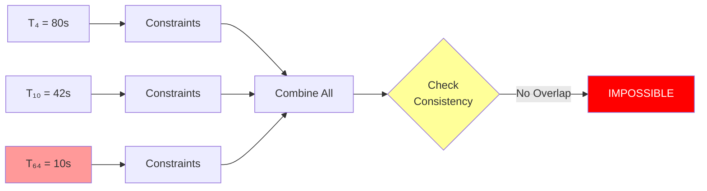
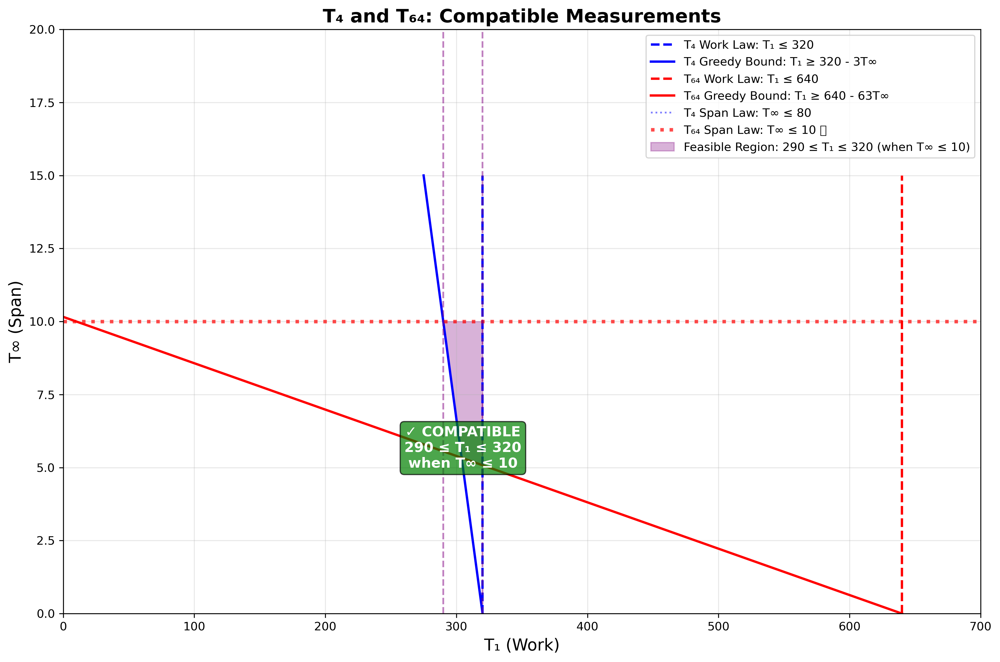
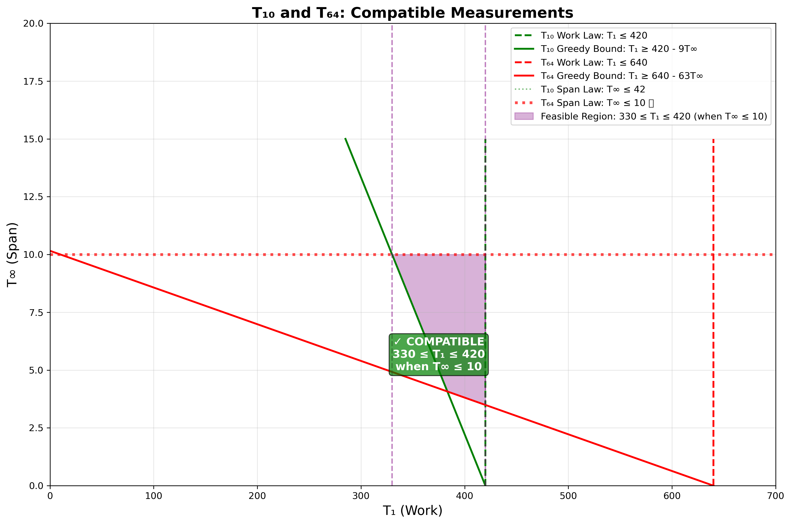
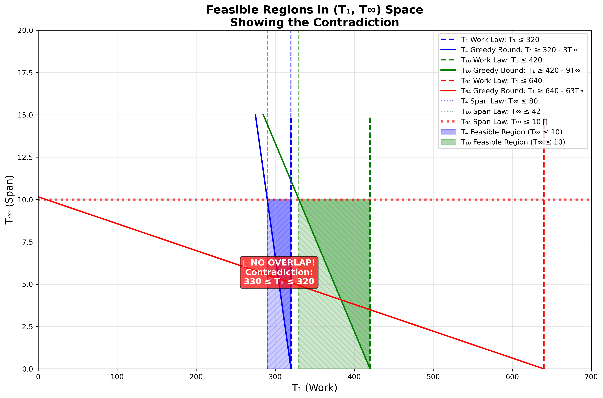

# Professor Karan's Inconsistent Measurements

> "The work-span model provides fundamental limits on parallel
> performance, independent of the scheduling algorithm." - CLRS Chapter 27

---

## Table of Contents

- [Problem Statement](#problem-statement)
- [Constraints from Each Measurement](#constraints-from-each-measurement)
  - [Constraints from $T_4 = 80$](#constraints-from-t_4--80)
  - [Constraints from $T_{10} = 42$](#constraints-from-t_10--42)
  - [Constraints from $T_{64} = 10$](#constraints-from-t_64--10)
- [Finding a Contradiction](#finding-a-contradiction)
  - [Step 1: Combine Span Law Constraints](#step-1-combine-span-law-constraints)
  - [Step 2: Check Consistency of $T_4$ and $T_{10}$](#step-2-check-consistency-of-t_4-and-t_10)
- [Visual Summary of Constraints](#visual-summary-of-constraints)
  - [Constraint Relationships](#constraint-relationships)
  - [Constraint Values Summary](#constraint-values-summary)
- [Intuitive Understanding of the Contradiction](#intuitive-understanding-of-the-contradiction)
  - [Why the Measurements Cannot All Be Correct](#why-the-measurements-cannot-all-be-correct)
  - [The Greedy Scheduler Bound in Action](#the-greedy-scheduler-bound-in-action)
  - [Pairwise Compatibility Analysis](#pairwise-compatibility-analysis)
  - [Visual Plot of the Contradiction](#visual-plot-of-the-contradiction)
  - [Plot Generation Code](#plot-generation-code)
- [What Could Have Gone Wrong?](#what-could-have-gone-wrong)
- [Most Likely Scenarios](#most-likely-scenarios)
- [Conclusion](#conclusion)

---

## Problem Statement

Professor Karan measures her deterministic multithreaded algorithm on 4,
10, and 64 processors of an ideal parallel computer using a greedy
scheduler. She claims that the three runs yielded:
- $T_4 = 80$ seconds
- $T_{10} = 42$ seconds
- $T_{64} = 10$ seconds

Argue that the professor is either lying or incompetent.

---

## Constraints from Each Measurement

For any valid set of measurements, the following laws must be satisfied:
- **Work Law**: $T_P \geq T_1/P$
- **Span Law**: $T_P \geq T_{\infty}$
- **Greedy Scheduler Bound** (from Exercise 27.1-3): $T_P \leq (T_1 - T_{\infty})/P + T_{\infty}$

Let us derive constraints from each measurement.

### Constraints from $T_4 = 80$

**Work Law**:
$$
T_1 \leq 320
$$

**Span Law**:
$$
T_{\infty} \leq 80
$$

**Greedy Scheduler Bound**:
$$
T_4 \leq \frac{T_1 - T_{\infty}}{4} + T_{\infty}
$$

$$
80 \leq \frac{T_1 - T_{\infty}}{4} + T_{\infty}
$$

$$
320 \leq T_1 - T_{\infty} + 4T_{\infty}
$$

$$
320 \leq T_1 + 3T_{\infty}
$$

$$
T_1 \geq 320 - 3T_{\infty}
$$

### Constraints from $T_{10} = 42$

**Work Law**:
$$
T_1 \leq 420
$$

**Span Law**:
$$
T_{\infty} \leq 42
$$

**Greedy Scheduler Bound**:
$$
T_{10} \leq \frac{T_1 - T_{\infty}}{10} + T_{\infty}
$$

$$
42 \leq \frac{T_1 - T_{\infty}}{10} + T_{\infty}
$$

$$
420 \leq T_1 - T_{\infty} + 10T_{\infty}
$$

$$
420 \leq T_1 + 9T_{\infty}
$$

$$
T_1 \geq 420 - 9T_{\infty}
$$

### Constraints from $T_{64} = 10$

**Work Law**:
$$
T_1 \leq 640
$$

**Span Law**:
$$
T_{\infty} \leq 10
$$

**Greedy Scheduler Bound**:
$$
T_{64} \leq \frac{T_1 - T_{\infty}}{64} + T_{\infty}
$$

$$
10 \leq \frac{T_1 - T_{\infty}}{64} + T_{\infty}
$$

$$
640 \leq T_1 - T_{\infty} + 64T_{\infty}
$$

$$
640 \leq T_1 + 63T_{\infty}
$$

$$
T_1 \geq 640 - 63T_{\infty}
$$

---

## Finding a Contradiction

### Step 1: Combine Span Law Constraints

From the Span Law:
- $T_{\infty} \leq 80$ (from $T_4$)
- $T_{\infty} \leq 42$ (from $T_{10}$)
- $T_{\infty} \leq 10$ (from $T_{64}$)

The tightest constraint is:

$$
T_{\infty} \leq 10
$$

### Step 2: Check Consistency of $T_4$ and $T_{10}$

If $T_{\infty} \leq 10$, then from the greedy scheduler bounds:
- From $T_4$: $T_1 \geq 320 - 3T_{\infty} \geq 320 - 3(10) = 290$
- From $T_{10}$: $T_1 \geq 420 - 9T_{\infty} \geq 420 - 9(10) = 330$

Also from Work Law:
- From $T_4$: $T_1 \leq 320$
- From $T_{10}$: $T_1 \leq 420$

So we need:

$$
330 \leq T_1 \leq 320
$$

This is **impossible**! There is no value of $T_1$ that satisfies both
$330 \leq T_1$ and $T_1 \leq 320$.

This contradiction proves that **at least one measurement is
incorrect**, meaning the professor is either lying or incompetent.

---

## Visual Summary of Constraints

Now that we've derived the contradiction step-by-step, here's a summary of how
the constraints from each measurement relate to each other:

### Constraint Relationships

The three measurements create constraints that must be satisfied simultaneously:



**Key insight**: When we apply the tightest span constraint ($T_{\infty} \leq 10$ from $T_{64}$)
and combine it with the greedy scheduler bounds from $T_4$ and $T_{10}$, we get
incompatible requirements on $T_1$, leading to the contradiction $330 \leq T_1 \leq 320$
(see [Step 2](#step-2-check-consistency-of-t_4-and-t_10) above for the detailed derivation).

### Constraint Values Summary

| Measurement   | Work Law       | Span Law               | Greedy Bound (when $T_{\infty} = 10$) |
|---------------|----------------|------------------------|--------------------------------------|
| $T_4 = 80$    | $T_1 \leq 320$ | $T_{\infty} \leq 80$   | $T_1 \geq 290$                       |
| $T_{10} = 42$ | $T_1 \leq 420$ | $T_{\infty} \leq 42$   | $T_1 \geq 330$                       |
| $T_{64} = 10$ | $T_1 \leq 640$ | $T_{\infty} \leq 10$ ⭐ | $T_1 \geq 10$                        |

**Note**: For generating actual 2D plots of the feasible regions, see the
[Plot Generation Code](#plot-generation-code) section below.

---

## Intuitive Understanding of the Contradiction

The contradiction $330 \leq T_1 \leq 320$ is **mathematically impossible**—no
number can be both at least 330 and at most 320. This arises from the
fundamental laws of parallel computation that must hold for any valid parallel
algorithm.

**The core issue**: The three measurements create conflicting constraints:
- $T_{64} = 10$ forces $T_{\infty} \leq 10$ (short critical path)
- $T_{10} = 42$ requires $T_1 \geq 330$ (given the short span)
- $T_4 = 80$ requires $T_1 \leq 320$ (from Work Law)

These cannot all be satisfied simultaneously. For a detailed geometric
interpretation and discussion of how the greedy scheduler bound reveals
inconsistencies, see the [Intuitive Understanding](#intuitive-understanding-of-the-contradiction)
section in [Write-up 3](write-up-3.md#intuitive-understanding-of-the-contradiction).

### Pairwise Compatibility Analysis

To understand which measurement is incompatible, let's examine each pair of
measurements:

#### Pairwise Compatibility Results





**Analysis**:
- **$T_4$ and $T_{10}$**: $194 \leq T_1 \leq 320$ (when $T_{\infty} \leq 42$) ✓ Compatible
- **$T_4$ and $T_{64}$**: $290 \leq T_1 \leq 320$ (when $T_{\infty} \leq 10$) ✓ Compatible
- **$T_{10}$ and $T_{64}$**: $330 \leq T_1 \leq 420$ (when $T_{\infty} \leq 10$) ✓ Compatible

All pairs are compatible individually, but the contradiction arises when all
three are considered together.

#### Summary: Pairwise Analysis

**Key insight**: Each pair of measurements is compatible when considered in
isolation:
- ✓ $T_4$ and $T_{10}$: $194 \leq T_1 \leq 320$ (when $T_{\infty} \leq 42$)
- ✓ $T_4$ and $T_{64}$: $290 \leq T_1 \leq 320$ (when $T_{\infty} \leq 10$)
- ✓ $T_{10}$ and $T_{64}$: $330 \leq T_1 \leq 420$ (when $T_{\infty} \leq 10$)

**The contradiction only arises when all three measurements are considered
together**:
- From $T_4$ and $T_{64}$: $290 \leq T_1 \leq 320$
- From $T_{10}$ and $T_{64}$: $330 \leq T_1 \leq 420$
- **No overlap**: $330 \leq T_1 \leq 320$ is impossible!

This demonstrates that **$T_{64}$ is incompatible with the combination of $T_4$
and $T_{10}$**, even though it's compatible with each individually. The
contradiction $330 \leq T_1 \leq 320$ shows that $T_{10}$ requires $T_1 \geq 330$,
while $T_4$ requires $T_1 \leq 320$, creating an impossible gap of 10 units.

### Visual Plot of the Contradiction

The following plot visualizes all constraints and demonstrates the contradiction:



**Key features**:
- **Blue region**: Feasible region from $T_4$ ($290 \leq T_1 \leq 320$ when $T_{\infty} \leq 10$)
- **Green region**: Feasible region from $T_{10}$ ($330 \leq T_1 \leq 420$ when $T_{\infty} \leq 10$)
- **Contradiction**: The regions do not overlap—there's a gap of 10 units between $T_1 = 320$ and $T_1 = 330$
- **Tightest constraint**: $T_{\infty} \leq 10$ from $T_{64}$ (red horizontal line)

For a detailed interpretation of constraint plots and their significance, see the
[Visual Plot of the Contradiction](write-up-3.md#visual-plot-of-the-contradiction) section in Write-up 3.

### Plot Generation Code

The plots are generated using Python scripts in `scripts/`:
- `generate_contradiction_plot_karan.py`: Main contradiction plot
- `generate_pairwise_plots_karan.py`: Pairwise compatibility plots

**To regenerate**: Run from `hw5/` directory:
```bash
python3 scripts/generate_contradiction_plot_karan.py
python3 scripts/generate_pairwise_plots_karan.py
```

For detailed plotting code and constraint line equations, see the
[Plot Generation Code](write-up-3.md#plot-generation-code) section in Write-up 3.

---

## What Could Have Gone Wrong?

Given the pairwise compatibility analysis:
- ✓ $T_4$ and $T_{10}$ are compatible
- ✓ $T_4$ and $T_{64}$ are compatible
- ✓ $T_{10}$ and $T_{64}$ are compatible
- ❌ All three together are incompatible

**Most likely scenario**: $T_{64}$ is incorrect. Since $T_4$ and $T_{10}$ are
compatible with each other and each is compatible with $T_{64}$ individually,
but all three together create a contradiction, **$T_{64}$ is the problematic
measurement**. The contradiction arises because $T_{64} = 10$ forces
$T_{\infty} \leq 10$, creating incompatible requirements when combined with
$T_4$ and $T_{10}$.

For a comprehensive discussion of possible sources of measurement error
(timing errors, algorithm inconsistency, hardware/environment issues, scheduler
behavior, measurement methodology) and practical investigation steps, see the
[What Could Have Gone Wrong?](write-up-3.md#what-could-have-gone-wrong) section
in Write-up 3.

---

## Conclusion

The measurements are **inconsistent**. As shown in [Finding a Contradiction](#finding-a-contradiction),
the three measurements lead to the impossible requirement $330 \leq T_1 \leq 320$.

**Therefore, Professor Karan is either lying or incompetent. At least one
of the measurements ($T_4$, $T_{10}$, or $T_{64}$) must be incorrect.**

The contradiction shows that it is impossible for all three
measurements to be correct simultaneously, given the fundamental laws
of parallel computation (Work Law, Span Law, and Greedy Scheduler
Bound from Exercise 27.1-3).

### Key Takeaways

1. **Fundamental laws are inviolable**: The Work Law, Span Law, and Greedy
   Scheduler Bound are mathematical truths. If measurements violate these
   laws, the measurements must be wrong.

2. **Pairwise compatibility doesn't guarantee overall consistency**: As
   demonstrated, each pair of measurements can be compatible individually, yet
   all three together create a contradiction. This highlights the importance
   of checking all constraints simultaneously.

3. **The contradiction is definitive**: Unlike statistical uncertainty, this
   is a mathematical impossibility. At least one measurement is definitively
   incorrect.

For additional insights on cross-validation, measurement methodology, and the
power of the greedy scheduler bound, see the [Key Takeaways](write-up-3.md#key-takeaways)
section in Write-up 3.

